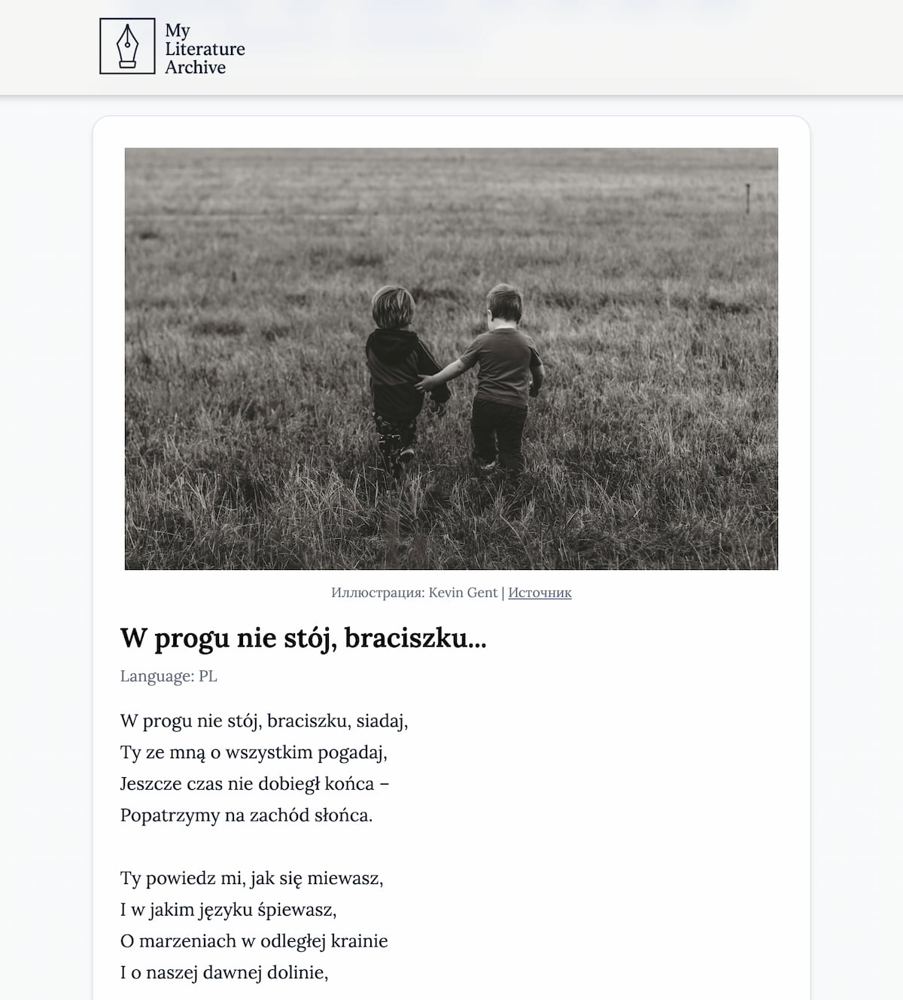

# 📚 My Literature Archive / Moje Archiwum Literatury

A personal literature archive for publishing and browsing poetry and prose. / Osobiste archiwum literackie do publikowania i przeglądania poezji oraz prozy.

The design follows a modern online magazine layout, with support for multiple languages and tag-based filtering. / Projekt inspirowany nowoczesnym układem magazynu online, z obsługą wielu języków i filtrowaniem według tagów.

---

## 📸 Preview / Podgląd



[🔗 View Live Demo / Zobacz wersję online](https://react-lit-archive.vercel.app/)

---

## 🛠️ Tech Stack / Technologie

- [React](https://reactjs.org/) — component-based frontend framework / framework frontendowy oparty na komponentach
- [Vite](https://vitejs.dev/) — fast build tool / szybkie narzędzie do budowania aplikacji
- [Tailwind CSS](https://tailwindcss.com/) — utility-first styling / narzędzie do stylizacji typu utility-first
- [Firebase Firestore](https://firebase.google.com/products/firestore) — cloud database / baza danych w chmurze
- [Git & GitHub](https://github.com/) — version control / kontrola wersji
- [Vercel](https://vercel.com/) — hosting and CI/CD / hosting i CI/CD

---

## 🚀 Getting Started / Jak zacząć

1. Clone the repository / Sklonuj repozytorium:

```bash
git clone https://github.com/vipozdniakov/react-lit-archive.git
cd react-lit-archive
```

2. Install dependencies / Zainstaluj zależności:

```bash
npm install
```

3. Create a .env file and add your Firebase config / Utwórz plik .env i dodaj konfigurację Firebase:

```env
VITE_FIREBASE_API_KEY=...
VITE_FIREBASE_AUTH_DOMAIN=...
VITE_FIREBASE_PROJECT_ID=...
VITE_FIREBASE_STORAGE_BUCKET=...
VITE_FIREBASE_MESSAGING_SENDER_ID=...
VITE_FIREBASE_APP_ID=...
```

4. Start the development server / Uruchom serwer deweloperski:

```bash
npm run dev
```

## ✨ Features / Funkcje

- Add and display literature entries (prose or poetry) / Dodawanie i wyświetlanie wpisów literackich (proza lub poezja)

- Text formatting preserved (e.g., line breaks in poetry) / Zachowanie formatowania tekstu (np. podziały wierszy)

- Full-text search across content and titles / Wyszukiwanie pełnotekstowe w treści i tytułach

- Language filter: Russian, Belarusian, Polish / Filtrowanie według języka: rosyjski, białoruski, polski

- Tag-based filtering with tag cloud / Filtrowanie według tagów i chmura tagów

- Minimalist magazine-style layout / Minimalistyczny układ w stylu magazynu

- 📈 Visitor statistics with Google Analytics 4 integration. / 📈 Statystyki odwiedzin dzięki integracji z Google Analytics 4.

## 🔒 Security Practices / Praktyki bezpieczeństwa

This project follows modern security best practices: / Projekt stosuje nowoczesne praktyki bezpieczeństwa:

- Sensitive data like API keys is managed via environment variables (.env). / Wrażliwe dane, takie jak klucze API, są zarządzane za pomocą zmiennych środowiskowych (.env).

- API keys are domain-restricted and only allowed minimal necessary access. / Klucze API są ograniczone do wybranych domen i mają minimalnie wymagane uprawnienia.

- Repository history has been fully cleaned of sensitive information. / Historia repozytorium została w pełni oczyszczona z poufnych informacji.

✅ The project is safe for public deployment and complies with open-source security standards. / Projekt jest bezpieczny do publicznego wdrożenia i zgodny ze standardami bezpieczeństwa open source.

## 🧠 Author / Autor

**[Vitali Pazdniakou](https://github.com/vipozdniakov)**

> "Silence is a word, too." /
> „Cisza to też słowo.”
